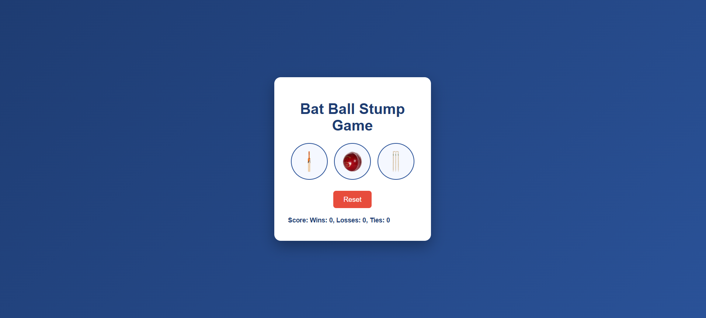

# 🏏 Bat Ball Stump Game

A simple browser-based mini game inspired by the classic Bat-Ball-Stump concept, built using **HTML**,CSS and **JavaScript**.

This project helped me practice JavaScript fundamentals, game logic, along with basic ID design and browser storage.

    ---folder structure---

Cricket_Game/
│
├── index.html
├── style.css
├── script.js
├── README.md
└── assets/
    ├── bat.png
    ├── ball.png
    ├── stump.png
    └── preview.png

---

## 🚀 Features

- 🎮 Play Bat, Ball, or Stump against the computer
- 🤖 Computer choice generated randomly
- 🖼 Image-based buttons for Bat, Ball, and Stump
- 💾 Score stored using **localStorage**
- 🔄 Score survives browser refresh
- ♻ Reset button to clear stored score
- 🎨 Clean and responsive UI using CSS

---

## 🛠 Technologies Used

- HTML5
- CSS3
- JavaScript (Vanilla JS)
- Browser LocalStorage

---

## 📚 What I Learned

- JavaScript functions & conditional logic
- Random number generation
- Object usage in JavaScript
- Using localStorage for data persistence
- Separating JavaScript into external files
- Basic UI styling with CSS
- Writing meaningful GitHub commits

---

## 📸 Preview

---

## 🔗 Project Link

- GitHub Repository:  
  👉https://github.com/Anishkumar-26/Cricket_Game.git

---

## 🙌 Feedback

Suggestions and feedback are always welcome.  
I’m learning step by step and improving every day.

⭐ If you like this project, feel free to star the repo!
